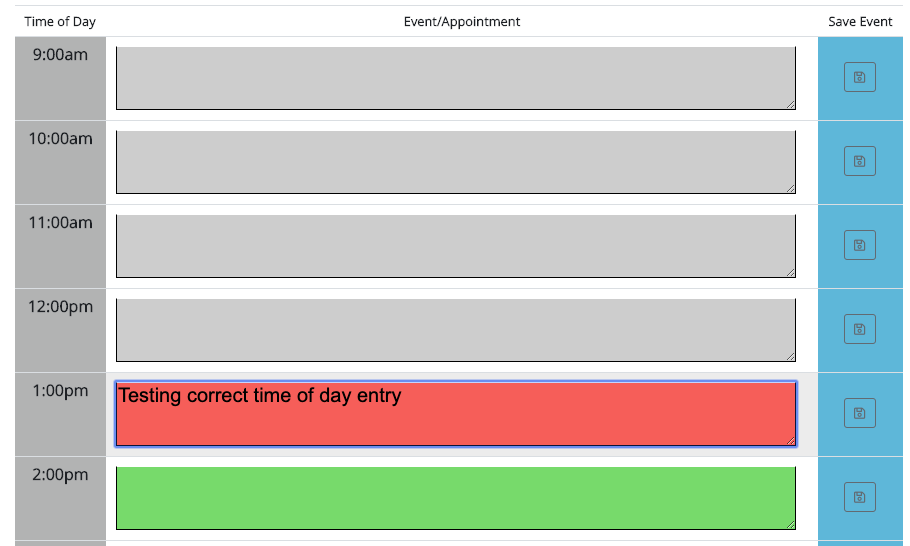
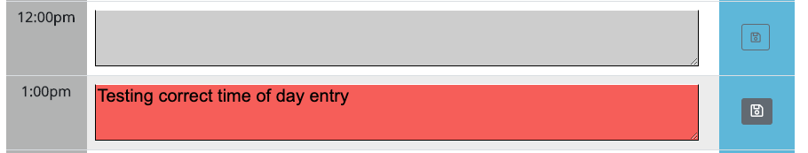
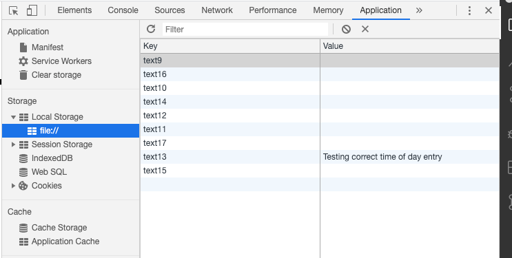
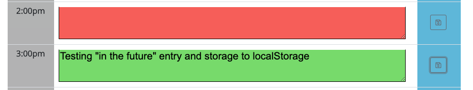
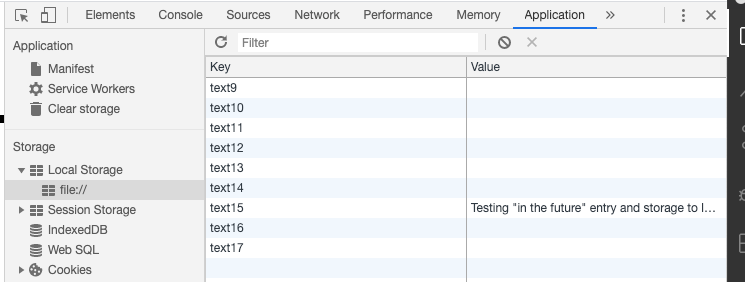

WORKDAY_SCHEDULER_HOMEWORK

Link: https://bpr59.github.io/Workday_Scheduler_HW/

General Information

* To begin this homework, we were provided an index file and a CSS file with the basic class labels we would need to create
the template for the homework. Also, one of the requirements was to use Moment.js library.

Homework requirements

The client requested a workday/scheduler that would allow him/her to enter hourly events/appointments. The scheduler needed to be able to manage time of day according to the correct time. Hourly color coding would let the user know if the 
event/appointment was in the past, present or future. All entries needed to be stored in localStorage as well as to have the capability to return the correct saved information to the Scheduler from localStorage.

HTML - CSS Development Process

* Using the CSS template file, I began developing the HTML file creating the following elements:
    - Added div to Jumbotron to include Moment.js information that would track local time of day
    - Added a table template to manage all the content of the main frame
    - Next step was to create divs for each of the columns with the following values
         . Time of Day
         . Event/Appointment
         . Save Event
    - Each div was linked to the CSS file to add style to the template
    - Once style was set, I copied the divs and duplicated them for each of the remaining hours

* This ScreenShot shows the completed frame with color coding according to time of day (12pm).

* ScreenShot of the time of day entry.

* ScreenShot of the save button function that send item to localStorage.

* ScreenShot of the time of day entry recorded to t localStorage.

* ScreenShot of future time of day entry.

* ScreenShot of localStorage recording of TimeOfDay entry.

JavaScript Development Process

* First I added Moment.js to the document and formatted it to show correct local time of day.
* Next I created variables for all the necessary hours of the day plus moment.js control variable that would manage the function.
* Function was developed to use moment.js value against schedule timeOfDay entry to be able to control the color coding of the textarea as requested.
* This function was cycled through all the schedule hours.
* Following step was to create variable for the eventListener that would control the sendItem information from each textarea to the corresponding localStorage entry that was triggered by the "save" button.
* Final step was to return the saved localStorage value to populate the textarea with the information the user requested that would show upcoming events/appointments.

* Just like the previous homework, this was the most challenging homework to date but this time I was able to complete the project even if it was with a few days extra. 

